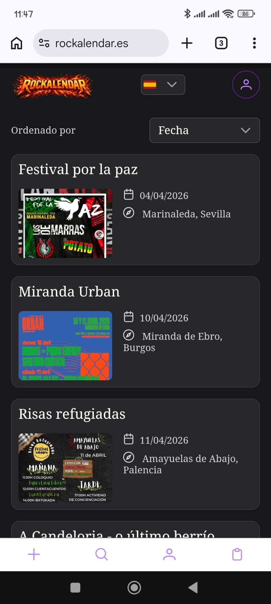
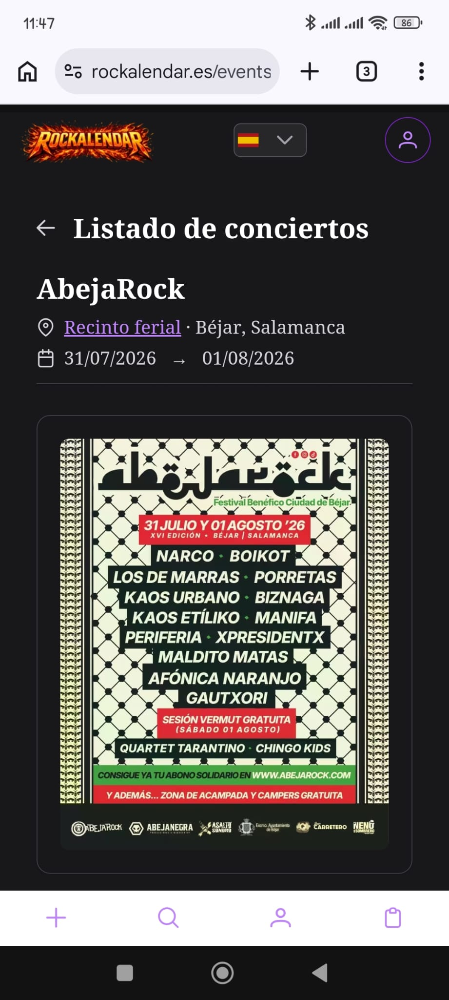
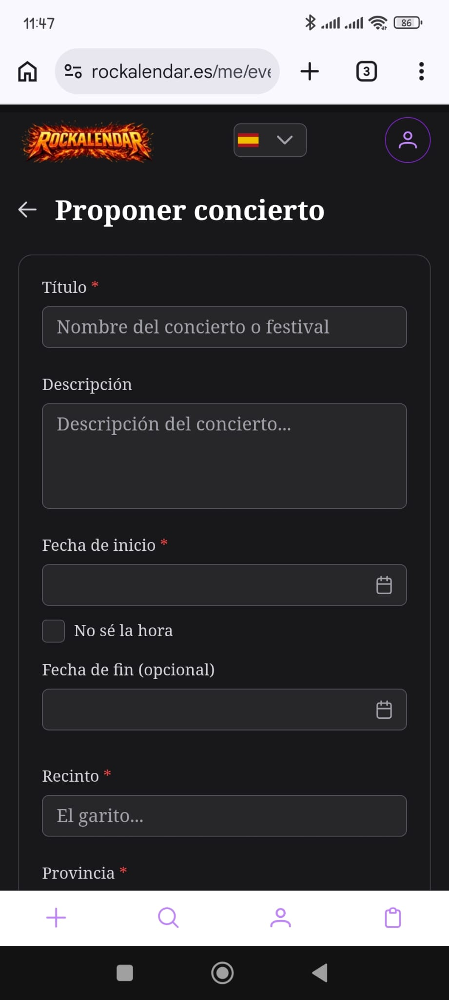
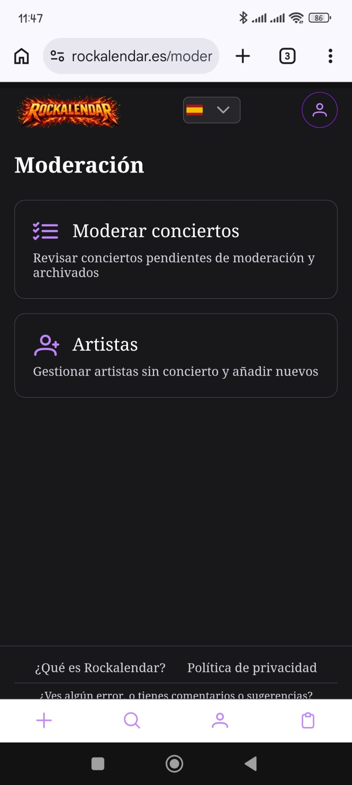

<p align="center">
  
</p>

---


**Rockalendar** es una agenda de conciertos y festivales de rock y metal en España, pensada para la escena independiente y underground.

Sin algoritmos de pago. Sin rankings artificiales. Sin ruido.
Los eventos los propone la comunidad; los publica un equipo de moderación humana.

---

## Capturas

<p align="center">
  
  
</p>
<p align="center">
  
  
</p>

---

## Funcionalidades principales

- **Búsqueda** por artista, ciudad, provincia, fecha o texto libre (tolerante a errores tipográficos).
- **Propuesta colaborativa**: cualquier usuario registrado puede proponer eventos; todos pasan por moderación antes de publicarse.
- **Agenda personal**: marca eventos como "me interesa" o "asistiré" y consúltalos cuando quieras.
- **Moderación humana**: panel para revisar, aprobar, rechazar o pedir correcciones. Con automoderaci­ón configurable para filtrar contenido problemático.
- **Gestión de artistas**: catálogo curado por moderadores; creación automática al proponer eventos.
- **Recuperación de contraseña** por email.
- **Sesión persistente con renovación silenciosa** de JWT.
- **Soporte multilenguaje** (ES/EN) según idioma del navegador.

---

## Filosofía

Este proyecto tiene un sesgo ético explícito: antifascista, anticapitalista, inclusivo con LGBTQ+.
El sistema de moderación existe en parte para filtrar contenido que contradiga esos valores.

Detallado en [**02 – Filosofía del proyecto**](docs/02-filosofia_del_proyecto.md).

---

## Documentación

La documentación técnica y funcional vive en [`docs/`](docs/).

| # | Documento | Contenido |
|---|-----------|-----------|
| 01 | [Visión y alcance](docs/01-vision_y_alcance.md) | Qué es Rockalendar, para quién y qué problema resuelve |
| 02 | [Filosofía del proyecto](docs/02-filosofia_del_proyecto.md) | Principios y valores que guían las decisiones |
| 03 | [Usuarios y casos de uso](docs/03-usuarios_y_casos_de_uso.md) | Perfiles, flujos reales y reglas de negocio |
| 04 | [Roadmap y MVP](docs/04-roadmap_y_mvp.md) | Definición del MVP y evolución por versiones |
| 05 | [Arquitectura](docs/05-arquitectura.md) | Stack, capas, seguridad, despliegue y observabilidad |
| 06 | [Modelo de dominio y datos](docs/06-modelo_de_dominio_y_datos.md) | Entidades, relaciones y modelo relacional |
| 07 | [ADRs](docs/07-adrs.md) | Decisiones técnicas clave y alternativas consideradas |
| 08 | [Guía de desarrollo](docs/08-guia_de_desarrollo.md) | Convenciones, comandos y flujo de trabajo |
| 09 | [Arquitectura frontend](docs/09-arquitectura_frontend.md) | Estructura, layouts, composables y estrategia de fetch |
| 10 | [Moderación y confianza](docs/10-moderacion_y_confianza.md) | Sistema de moderación, score y automoderaci­ón |

---

## Tecnologías

**Backend**
- Java 21 + Spring Boot
- PostgreSQL 16 (FTS + pg_trgm para búsqueda)
- Flyway (migraciones)
- JWT HS256 (autenticación)
- OpenAPI code-first (Swagger UI en perfil `dev`)
- Testcontainers (tests de integración contra PostgreSQL real)

**Frontend**
- Vue 3 + Nuxt 4
- PrimeVue 4 + PrimeFlex
- i18n con `@nuxtjs/i18n`

**Infraestructura**
- Docker / Docker Compose
- MinIO (almacenamiento de carteles)
- Coolify (despliegue en producción)

---

## Arranque local

### Requisitos

- Docker + Docker Compose
- Java 21 + Maven 3.9+
- Node.js 22+

### 1. Infraestructura (PostgreSQL + Mailhog)

```bash
docker compose -f docker/compose.yml -p rockalendar up -d
```

> El compose incluye [Mailhog](https://github.com/mailhog/MailHog): captura todos los correos salientes sin enviarlos. Bandeja disponible en [http://localhost:8025](http://localhost:8025).

Para parar:
```bash
docker compose -f docker/compose.yml -p rockalendar down
```

Para resetear datos (borra el volumen):
```bash
docker compose -f docker/compose.yml -p rockalendar down -v && docker compose -f docker/compose.yml -p rockalendar up -d
```

### 2. Backend

```bash
cd backend
mvn clean spring-boot:run -Dspring-boot.run.profiles=dev,local
```

La API arranca en [http://localhost:8080](http://localhost:8080).
Swagger UI disponible en [http://localhost:8080/swagger-ui/index.html](http://localhost:8080/swagger-ui/index.html).

**Variables de entorno necesarias en local:**

| Variable | Valor en local |
|----------|----------------|
| `SPRING_PROFILES_ACTIVE` | `dev,local` |
| `JWT_SECRET` | cualquier cadena larga (mínimo 32 chars) |
| `EMAIL_FROM` | tu correo (solo referencial, Mailhog lo captura) |
| `BREVO_SMTP_USER` / `BREVO_SMTP_PASSWORD` | solicitar al administrador |

### 3. Frontend

```bash
cd frontend
npm install
```

Crear `.env` en `frontend/`:
```
NUXT_PUBLIC_API_BASE=http://localhost:8080/api
```

```bash
npm run dev
```

La aplicación arranca en [http://localhost:3000](http://localhost:3000).

> Las instrucciones completas están en la [**Guía de desarrollo**](docs/08-guia_de_desarrollo.md).

---

## Flujo de trabajo (Git)

- Rama principal: `main`
- Todo cambio entra mediante Pull Request
- Convención de ramas: `feature/<tema>`, `fix/<tema>`, `docs/<tema>`
- Commits en [Conventional Commits](https://www.conventionalcommits.org/) en castellano
- Historial de cambios en [`CHANGELOG.md`](CHANGELOG.md)

Detalles en la [**Guía de desarrollo**](docs/08-guia_de_desarrollo.md).

---

## Autor

Proyecto personal desarrollado y mantenido por **jmarfil**.

---

## Licencia

[GNU Affero General Public License v3.0](LICENSE)

El uso del código fuente de este proyecto en servicios de red (SaaS) obliga a publicar las modificaciones bajo la misma licencia.
